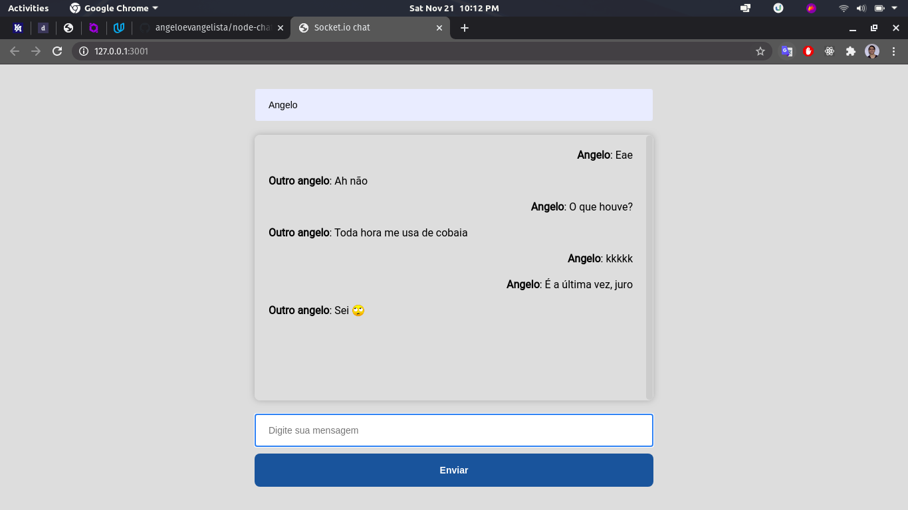

# Node chat

# Como executar

clone o projeto na sua máquina usando a cli do git:

```bash
git clone https://github.com/angeloevangelista/node-chat.git
```

Após isso rode `yarn`, ou `npm install`, para baixar as dependências, agora basta iniciar o projeto com os scripts já existentes.

- `build` - Gera o JavaScript transpilado.
- `start` - Gera o JS transpilado e executa.
- `dev` - Inicia o servidor local de desenvolvimento.


